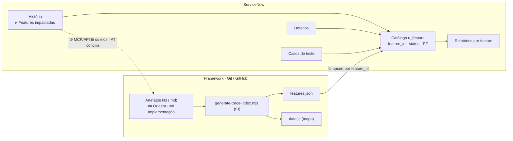

# Integração com o ServiceNow

Como manter **dois mundos** em sincronia sem que virem duas verdades que brigam:
o framework (specs em Git) e o ServiceNow (histórias, defeitos, testes). A regra
de ouro é **um dono por fato**, com o **ID da feature** costurando os dois lados.


## Quem é dono de quê

| Fato | Dono (fonte de verdade) | O outro lado |
|---|---|---|
| **Definição** da feature (nome, regras, cenários, campos) | Framework (N3 no git) | ServiceNow recebe |
| **Identidade** (`SIGLA-SFS-NN`) | Framework | ServiceNow usa como chave |
| **Ciclo de vida da spec** (📋→🔄→✅→❌) | Framework (`INDEX.md`) | ServiceNow recebe |
| **PF/CFP** (contagem) | Framework (`SIZING`/3B) | ServiceNow recebe |
| **História → features impactadas** | **ServiceNow** | Framework lê de volta (`## Origem`) |
| **Defeitos, testes, execução** | **ServiceNow** | Framework lê para métricas |

> A **chave de junção** é o `SIGLA-SFS-NN` — idêntico nos dois mundos. Sem uma
> chave estável e igual dos dois lados, nada disso fecha.

## Os dois fluxos

**① git → ServiceNow (catálogo — uma via, automática).** O build gera
[`features.json`](#/mapa-rastreabilidade) a partir dos `.md`; do lado do
ServiceNow, um *Scheduled Import* / *Table API* faz **upsert por `feature_id`**
na tabela `u_feature`. Feature nova aparece, status muda, deprecada é marcada
(**nunca apagada** — defeitos e testes apontam para ela).

**② ServiceNow → git (leitura dos elos).** Ao atender a história, você marca as
**"Features impactadas"** no ServiceNow. O framework **lê** esse elo (via MCP/API)
e o materializa na seção `## Origem` do N3 + `_backlog/` + `INDEX.md`; a auditoria
**AT** (`PROMPT_AUDIT_TRACE_LINKS`) reconcilia e flagra elos unilaterais.

## O lado do framework já é nosso: o gerador

O `features.json` (e o `data.js` do mapa) saem de um único script determinístico,
que varre a instância e **não depende do ServiceNow**:

```bash
node scripts/generate-trace-index.mjs \
  --root ../simpf-doc \
  --out-features build/features.json \
  --out-data docs/rastreabilidade/data.js \
  --repo https://github.com/andromarcio/simpf-doc --branch main
```

Ele lê o que já existe nos artefatos: cabeçalho do N3 (`SIGLA-SFS-NN` + status +
PF), `## Origem` (histórias), `## Implementação` (repositórios), `## Feature Sets`
e `## Integrações` do N1. Mesma matéria-prima da auditoria `AT`, agora também como
catálogo. Um exemplo de saída (`features.json`):

```json
{
  "feature_id": "VND-CAR-01",
  "name": "Adicionar ao Carrinho",
  "domain": "VND", "feature_set": "VND-CAR",
  "status": "impl", "pf": 5,
  "stories": ["STRY0012501", "STRY0013700"],
  "repos": ["loja-web"],
  "spec_url": "https://github.com/acme/loja-doc/blob/main/modules/vendas/carrinho/f-adicionar-item.md"
}
```

## Duas decisões (dependem da sua instância ServiceNow)

1. **Tabela custom (`u_feature`)** ou reaproveitar um construto existente
   (CMDB / Application Service / Product Model)?
2. **Quem é dono do elo história↔feature**: ServiceNow (recomendado — é onde você
   atende) com o framework lendo de volta, ou o framework escrevendo no SN?

## Fonte do diagrama (Mermaid — para o time editar)


