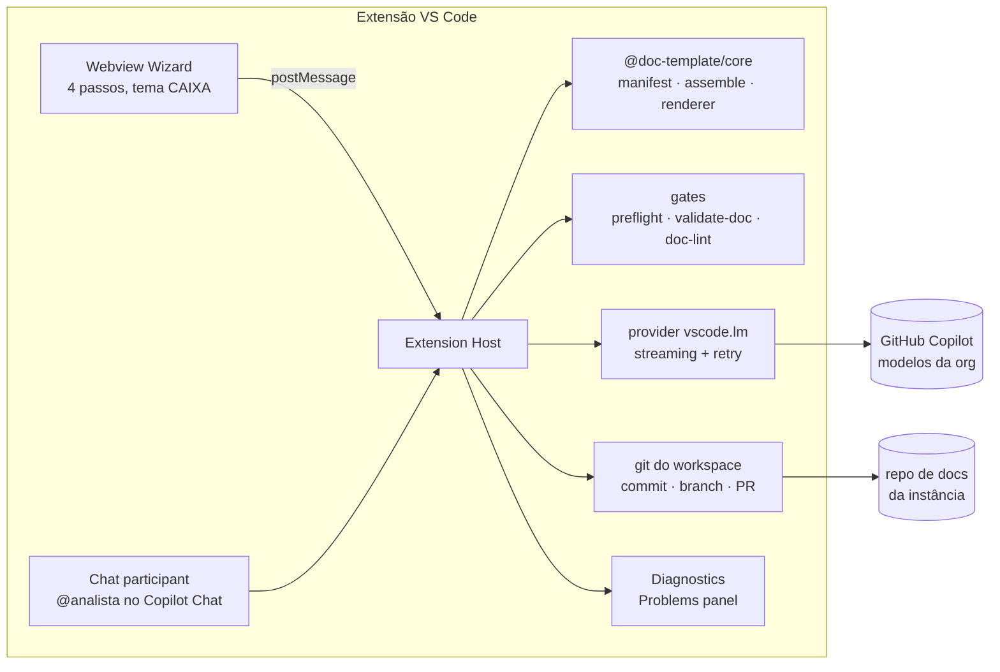

# Plano — Extensão VS Code do doc-template (Copilot LM API oficial)

> **Status**: proposta aprovada para planejamento · **Autor**: sessão Claude Code · **Data**: 2026-07-02
> **Motivação**: viabilizar o framework na CAIXA, onde o acesso a LLMs é exclusivamente
> via GitHub Copilot (sem Claude Code, sem API Anthropic) e o público-alvo (analistas/POs)
> não domina a IDE. A extensão usa a **Language Model API oficial do VS Code**
> (`vscode.lm`) — canal suportado, sem engenharia reversa — e entrega o fluxo completo
> do framework (gerar → validar → revisar → commitar) atrás de um wizard, sem exigir
> conhecimento de VS Code, prompts ou terminal.

---

## 1. Objetivo e princípios

Empacotar o motor do doc-template como uma **extensão do VS Code** que:

1. **Gera artefatos N0–N3** usando os modelos do Copilot habilitados na organização
   (Haiku, Sonnet, GPT, Gemini — o que a política corporativa liberar), via API oficial.
2. **Enforça os gates por pipeline, não por prompt** — preflight (F1) injetado
   automaticamente, validador estrutural (F2) em loop de auto-correção, review
   semântico (PROMPT_REVIEW) como etapa opcional. É isso que torna modelos menores
   (Haiku) utilizáveis: a disciplina estrutural sai do modelo e entra no harness.
3. **Esconde a IDE**: o usuário abre um painel, segue um wizard de 4 passos e clica
   em salvar. Git, prompts, dicionários e validação acontecem nos bastidores.
4. **Não depende de infraestrutura**: nada de servidor, chave de API ou login
   device-flow. A credencial é a sessão do Copilot já ativa no editor do usuário.

**Princípios de arquitetura:**

- **Um motor, várias superfícies.** O núcleo (manifest, montagem de prompt, gates,
  renderer) vira um pacote independente de front-end. CLI, Studio web e extensão
  consomem o mesmo código — corrigiu num lugar, corrigiu em todos.
- **O modelo não escreve estrutura.** Meta de médio prazo: o LLM devolve **conteúdo
  estruturado (JSON)** e o renderer determinístico produz o markdown no template.
  "Não seguiu o template" deixa de ser possível por construção.
- **Fail-open, como o spec-guard**: falha de gate nunca trava o usuário — degrada
  para aviso com relatório.

---

## 2. Por que a LM API oficial (e não o endpoint atual do Studio)

O provider Copilot do Studio (`scripts/providers/copilot.mjs`) usa o endpoint do
editor por engenharia reversa (`api.githubcopilot.com` + device-flow) — o próprio
código avisa que pode **violar os termos do Copilot** e quebrar sem aviso. Num banco,
isso é bloqueio de conformidade.

A **Language Model API** (`vscode.lm`, estável desde o VS Code 1.90) é o mecanismo
**suportado** para uma extensão consumir os modelos do Copilot do usuário:

| Aspecto | Endpoint reverso (Studio hoje) | `vscode.lm` (extensão) |
|---|---|---|
| Suporte oficial | ❌ não suportado, pode violar ToS | ✅ API pública documentada |
| Autenticação | device-flow + troca de token manual | sessão do Copilot no editor (zero setup) |
| Modelos | lista embutida, pode divergir | `selectChatModels()` — reflete a política da org |
| Consentimento | nenhum | diálogo de consentimento por extensão (auditável) |
| Cobrança | idem assinatura | idem assinatura (premium requests por modelo) |
| Risco de quebra | alto (protocolo interno) | baixo (API versionada) |

Uso típico:

```typescript
const [model] = await vscode.lm.selectChatModels({ vendor: 'copilot', family: 'claude-haiku-4.5' });
const messages = [vscode.LanguageModelChatMessage.User(systemAndPrompt)];
const res = await model.sendRequest(messages, { justification: 'Gerar especificação N3' }, token);
for await (const chunk of res.text) { /* streaming para o webview */ }
```

Pontos de atenção da API (viram itens do spike, seção 7):

- **Sem papel `system`** — instruções entram na primeira mensagem `User` (a montagem
  do `assemble()` já concatena system+user; adaptação trivial).
- **Teto de tokens de saída** imposto pelo serviço do Copilot (historicamente
  ~4k–8k para vários modelos). N3 longos podem truncar → mitigação: geração **por
  seções** com costura determinística, e/ou loop de continuação.
- **Anexos**: a API de mensagens é texto (suporte a imagem ainda restrito/proposto).
  PDF/DOCX/XLSX seguem pelo caminho que já existe: extração de texto local
  (`extract.mjs` usa mammoth/pdf-parse/xlsx — roda igual no extension host).
- **Premium requests**: cada `sendRequest` consome cota do plano Copilot do usuário
  conforme o multiplicador do modelo (Haiku e Flash são baratos; isso favorece o
  loop de auto-correção com modelos pequenos).
- **Política corporativa**: o admin da org controla quais modelos aparecem. A
  extensão deve se adaptar dinamicamente ao catálogo (`selectChatModels` sem
  `family` → lista completa) em vez de fixar nomes.

---

## 3. Arquitetura



### 3.1 Componentes

| Componente | O que faz | Origem |
|---|---|---|
| `@doc-template/core` | manifest de opções, carga de globals/domínio, montagem do prompt, resolução de caminho de saída, cascata de atualização do pai | **extraído** de `scripts/core.mjs` + `manifest.mjs` do Studio (hoje acoplados a env/Anthropic) — vira pacote TS puro, sem dependência de VS Code nem de provider |
| `gates/` | wrappers em memória de `validate-doc.mjs`, `doc-lint.mjs`, `preflight-spec.mjs` | **reuso direto** dos scripts do engine (são determinísticos e sem deps); `validate-doc` ganha modo "validar string" além de "validar arquivo" |
| `providers/vscode-lm.ts` | implementa a interface `LlmProvider { generate, stream, countTokens, listModels }` sobre `vscode.lm` | **novo** (~200 linhas) |
| Webview Wizard | UI de 4 passos (Ação → Local → Dados → Gerar/Salvar), streaming, relatório de gates, upload de insumos | **novo**, leve (Lit ou Preact + CSS com variáveis de tema do VS Code); reaproveita `models.ts` (tipos) e o fluxo/labels do Studio; tema CAIXA portado do `theme-caixa.css` |
| Chat participant `@analista` | mesma pipeline exposta no Copilot Chat para o público dev (`@analista /n3 ...`, `/review`) | **novo** (~150 linhas), API estável `vscode.chat` |
| Diagnostics | roda `validate-doc` ao salvar qualquer artefato N0–N3 do workspace e publica violações no painel Problems (squiggles no arquivo) | **novo** (~100 linhas) — é o spec-guard nativo da IDE, funciona até para quem editar na mão |
| Git | commit/branch/push via `child_process` git (mesma lógica de `saveArtifact`/`savePullRequest` do server) ou API de SCM do VS Code | **portado** do server do Studio |

### 3.2 O que se reaproveita vs. o que se abandona

**Reuso (com extração para o core):** `manifest.mjs` (mapa de opções + questionários,
260 linhas, zero deps), lógica de `assemble`/`loadGlobals`/`buildTree`/`resolveOutputPath`/
`cascadeUpdateParent` de `core.mjs`, `extract.mjs`, os três gates do engine, os prompts
de `engine/prompts/` (empacotados no VSIX **ou** lidos do repo da instância — ver 3.3),
tipos de `models.ts`, identidade visual do `theme-caixa.css`.

**Abandona-se (nesta superfície):** o servidor Express (a extensão *é* o backend), o
provider Anthropic SDK (fica no core para o Studio web continuar usando), o provider
Copilot reverso (**deprecar** assim que a extensão validar — remover o risco de ToS do
repositório), o front Angular (pesado demais para webview; o wizard tem 4 telas — o
custo de portar o fluxo é menor que o de embutir Angular 21 + adaptar HttpClient/proxy
para postMessage/CSP).

### 3.3 Prompts e templates: de onde vêm

Duas fontes, em ordem de precedência:

1. **Do workspace** — se a pasta aberta é uma instância (tem `engine/prompts/`),
   usa os prompts dela (respeita a versão pinada da instância, como hoje).
2. **Embutidos no VSIX** — fallback para quem abre o repo de docs sem o engine
   vendorizado; a versão embutida acompanha o release da extensão e carimba os
   artefatos com `engine/VERSION` correspondente.

O repositório de docs de destino é a **pasta aberta no VS Code** (ou escolhida num
picker na primeira execução) — elimina o conceito de `DOCS_REPO_DIR`/`.env`.

### 3.4 Pipeline de geração (o coração do plano)

```
1. PREFLIGHT (F1, determinístico)     preflight-spec → "Contexto verificado" injetado como 1º insumo
2. MONTAGEM                           assemble(prompt + globals + domínio + insumos + questionário)
3. ORÇAMENTO                          countTokens vs model.maxInputTokens → poda/alerta antes de enviar
4. GERAÇÃO (streaming)                vscode.lm sendRequest → webview em tempo real
5. GATE ESTRUTURAL (F2, determinístico)  validate-doc em memória
      └─ reprovou? → reenvia desvios ao modelo ("corrija e devolva completo")
         até 3 iterações; persiste reprovado? → mostra relatório e bloqueia o salvar
         com override consciente ("salvar mesmo assim" + carimbo ⚠️)
6. REVIEW SEMÂNTICO (opcional, LLM)   PROMPT_REVIEW one-shot com modelo ≠ do gerador
7. SALVAR                             grava no caminho canônico + commit (ou branch+PR) + cascata no pai
8. PÓS                                doc-lint incremental + atualização do Problems panel
```

Configurações por papel (settings da extensão): `docTemplate.model.generation`,
`docTemplate.model.review`, `docTemplate.model.mechanical` (extração/pendências) —
com default "auto" (melhor modelo disponível no catálogo para cada papel). Revisão
cruzada (gerador ≠ revisor) é o default quando há ≥2 modelos.

---

## 4. Escopo funcional por release

### MVP (release 0.1 — piloto)

- Wizard com as opções negociais do manifest: **0, 1A, 2A, 3A, CR, RT, NFR, 4A**
- Pipeline completa da seção 3.4 com gates F1+F2 (review semântico fora do MVP)
- Salvar com commit direto + cascata; histórico dos últimos commits
- Diagnostics (validate-doc no save) — já entrega valor para o fluxo manual
- Seletor de modelo com catálogo dinâmico + estimativa de premium requests
- Onboarding: detecção de instância, aviso claro quando o Copilot não está ativo

### Release 0.2 — qualidade

- **RV**: PROMPT_REVIEW one-shot como opção do menu + painel de relatório com achados
  navegáveis (clicou no achado → abre o arquivo na linha)
- Revisão cruzada automática pós-geração (opt-in)
- **QA**: PROMPT_QA com questionário (framework de teste vira pergunta do wizard)
- Modo PR (branch + push + link para abrir o PR — sem depender de `gh`)

### Release 0.3 — robustez estrutural

- **Saída estruturada**: schema JSON por tipo de artefato + tool calling da LM API
  (`LanguageModelChatTool`) ou parse com loop de reparo; renderer determinístico
  markdown a partir do template. Começa pelo **3A** (maior volume e maior incidência
  de desvio no Haiku). O validate-doc vira teste do renderer, não do modelo.
- Geração por seções para contornar o teto de saída (costura determinística)

### Release 0.4 — superfície dev

- Chat participant `@analista` com slash commands (`/n3`, `/review`, `/pendencias`)
- Comandos no palette e menu de contexto do explorer ("Revisar este artefato")

---

## 5. Estrutura do repositório

Novo diretório no **doc-template-engine** (a extensão é ferramenta do framework;
a instância CAIXA só configura tema/defaults):

```
doc-template-engine/
  packages/
    core/                 # @doc-template/core — motor extraído (TS, zero deps de UI)
      src/{manifest,assemble,render,tree,output,cascade}.ts
      src/gates/{validate,lint,preflight}.ts     # wrappers em memória dos scripts
      src/providers/{types,anthropic}.ts          # interface + provider do Studio web
      test/                                       # golden tests com artefatos reais
  extension/
    package.json          # contributes: commands, views, chat, configuration
    src/
      extension.ts        # ativação, registro de comandos/participant/diagnostics
      provider-lm.ts      # LlmProvider sobre vscode.lm
      pipeline.ts         # orquestração da seção 3.4
      wizard/panel.ts     # WebviewPanel + protocolo postMessage
      chat/participant.ts
      diagnostics.ts
      git.ts
    media/                # bundle da UI (Lit/Preact) + tema
  scripts/                # (existentes — passam a delegar para packages/core)
```

O Studio web (`doc-template-studio-caixa/studio`) migra para consumir
`@doc-template/core` numa fase posterior — fora do caminho crítico deste plano,
mas é o que garante paridade permanente entre as superfícies.

---

## 6. Distribuição e governança na CAIXA

- **Empacotamento**: `vsce package` → `.vsix`. Distribuição interna
  (compartilhamento direto ou repositório de extensões privado, se a CAIXA tiver).
  Instalação: `code --install-extension doc-template-x.y.z.vsix` ou pela UI.
- **Aprovações necessárias (levantar cedo — são o risco real de cronograma):**
  1. política de instalação de extensões não-marketplace nas estações;
  2. política Copilot da org: modelos habilitados e se extensões de terceiros
     podem consumir a LM API;
  3. classificação de dados: os insumos (transcrições, docs internos) já trafegam
     pelo Copilot hoje — a extensão não cria fluxo de dados novo, e esse argumento
     deve constar do dossiê de aprovação.
- **Sem telemetria externa.** Log local em Output channel; nada sai da máquina
  além das chamadas ao Copilot que já existem hoje.

---

## 7. Fase 0 — Spike de viabilidade (bloqueante, antes de qualquer código de produto)

Mini-extensão descartável (~2 dias de código + validação na estação da CAIXA) que
responde, **no ambiente real**:

| # | Pergunta | Critério go/no-go |
|---|---|---|
| S1 | `selectChatModels()` retorna modelos na org da CAIXA? Quais? (confirmar se Sonnet aparece) | ≥1 modelo utilizável |
| S2 | Qual o `maxInputTokens` e o teto **de saída** real por modelo? Um N3 típico (3A + globals ≈ 15–25k tokens in, 3–6k out) passa inteiro? | saída ≥ 4k ou geração por seções viável |
| S3 | Loop gerar→validate-doc→corrigir converge com Haiku em ≤3 iterações num 3A real? | ≥80% dos casos de teste |
| S4 | Consumo de premium requests por artefato (geração + 2 correções + review) é aceitável para a cota dos analistas? | estimativa aprovada pelo gestor |
| S5 | VSIX sideload é permitido na estação padrão? | sim, ou rota de exceção definida |

**No-go em S1/S5** → plano B: prompt files do Copilot Chat (`.github/prompts/*.prompt.md`)
com o protocolo F1/F2 embutido no texto + CI rodando os gates no repo de docs. Menor
UX, zero aprovação nova.

---

## 8. Cronograma e esforço (1 dev, estimativas em semanas úteis)

| Fase | Entrega | Esforço | Depende de |
|---|---|---|---|
| **F0** | Spike na CAIXA (seção 7) + decisão go/no-go | 1 | acesso à estação CAIXA |
| **F1** | `@doc-template/core` extraído + golden tests + gates em memória | 1–1,5 | F0 go |
| **F2** | MVP (release 0.1): wizard + pipeline + salvar/commit + diagnostics | 2–3 | F1 |
| **F3** | Release 0.2: review RV + revisão cruzada + QA + modo PR | 1,5–2 | F2 |
| **F4** | Piloto com 2–3 analistas na CAIXA + ajustes | 1–2 | F2 (roda em paralelo a F3) |
| **F5** | Release 0.3: saída estruturada + renderer (começando pelo 3A) | 2–3 | F2 |
| **F6** | Release 0.4: chat participant + comandos | 1 | F2 |

Caminho crítico até o piloto: **F0 → F1 → F2 → F4 ≈ 5–7 semanas.**

---

## 9. Riscos e mitigações

| Risco | Prob. | Impacto | Mitigação |
|---|---|---|---|
| Org bloqueia LM API para extensões terceiras | média | alto | descobrir no F0 (S1); plano B: prompt files + CI |
| Teto de saída trunca N3 longos | alta | médio | geração por seções (F5 antecipável); loop de continuação no MVP |
| VSIX barrado pela governança de estações | média | alto | S5 no F0; dossiê de segurança pronto (seção 6) |
| Haiku não converge nem com gates | baixa | médio | S3 mede; fallback: exigir Sonnet/GPT para geração, Haiku só em papéis mecânicos |
| Catálogo de modelos muda sem aviso | alta | baixo | catálogo dinâmico + papéis "auto" (3.4) |
| Deriva entre extensão e Studio web | média | médio | F1 (core único) é justamente o antídoto; Studio migra depois |
| Anexos com imagem (protótipos, prints) não passam pela LM API | média | baixo | extração de texto local; imagens ficam como pendência documentada no artefato |

---

## 10. Critérios de sucesso do piloto

1. Analista sem experiência em VS Code gera um N3 **aprovado pelo validate-doc** a
   partir de um questionário, em menos de 15 minutos, sem tocar em prompt/terminal/git.
2. Taxa de convergência do gate F2 ≥ 80% em ≤3 iterações com o melhor modelo
   disponível na CAIXA.
3. Zero uso do endpoint não-oficial do Copilot (provider reverso deprecado).
4. Artefatos do piloto carimbados e rastreáveis (`engine/VERSION` + prompt ID),
   commitados no repo de docs pela própria extensão.

---

## 11. Decisões em aberto (levantar com a CAIXA antes do F0)

- Lista exata de modelos no Copilot corporativo (os rótulos citados — "Gemini 3.5
  Flash", "GPT 4.3" — precisam ser confirmados no picker real) e se **Sonnet** está
  ou pode ser habilitado.
- Existe caminho para **Azure OpenAI / AI Foundry** no contrato Microsoft? (Se sim,
  vira um segundo provider oficial no core — a arquitetura já prevê.)
- Processo formal de homologação de extensão interna (prazos, requisitos).
- Cota de premium requests por analista/mês (dimensiona S4).
