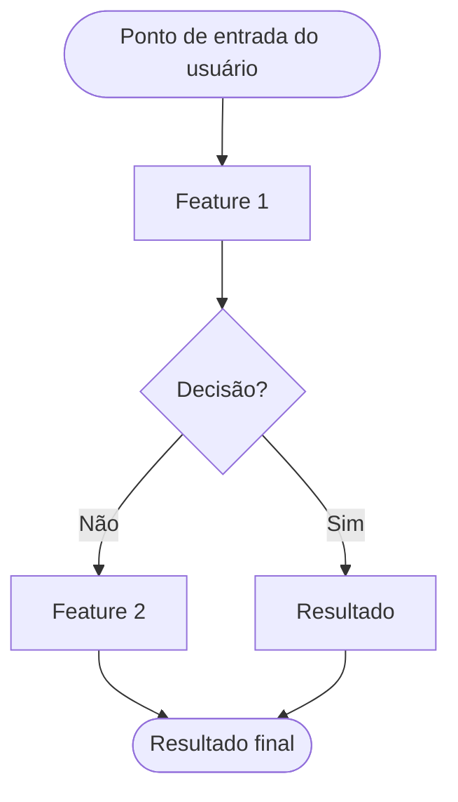

# Feature Set: [Nome do Feature Set]
> **Nível 2** - Domínio: [Nome do Domínio] - `[SIGLA]-[SFS]`

## Descrição
[Descrição em 2-3 frases do que este Feature Set faz.]

**Não faz**: [o que está explicitamente fora do escopo.]

---

## Features

| Feature | Arquivo de Especificação (N3) | Descrição |
|---|---|---|
| **[Nome da Feature]** <small>[SIGLA]-[SFS]-01</small> | [f-[verbo]-[entidade].md](f-[verbo]-[entidade].md) | [descrição em uma linha] |

---

## Fluxo Principal

---

## Dependências entre features

[lista descrevendo pré-requisitos e relações entre as features]

---

## Telas

| Tela | Rota sugerida | Features atendidas | Descrição |
|---|---|---|---|
| [Nome da tela] | `/[rota]` | **[Nome da Feature]** <small>[SIGLA]-[SFS]-01</small> | [o que a tela mostra] |

---

## Permissões por perfil

> **Fonte única de permissões** deste Feature Set. As features (N3) não tratam de
> perfis nem permissões — qualquer acesso novo ou diferente entra nesta matriz.

Perfis: **[Perfil A]**, **[Perfil B]**, **[Perfil C]**.

| Perfil | [Ação 1] | [Ação 2] | [Ação 3] |
|---|---|---|---|
| **[Perfil A]** | ✓ | ✓ | ✓ |
| **[Perfil B]** | ✓ | — | ✓ |
| **[Perfil C]** | ✓ | — | — |

* **[Perfil A]** — [nível de acesso em uma linha].

---

## Changelog

| Data | Autor | Tipo | Descrição |
|---|---|---|---|
| [AAAA-MM-DD] | [autor] | N2 criado | Gerado pelo PROMPT 2A |

---

*Links: [N1 do domínio](../README.md) · [INDEX geral](../../INDEX.md)*
